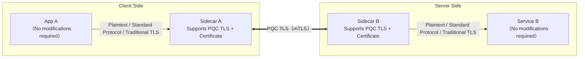
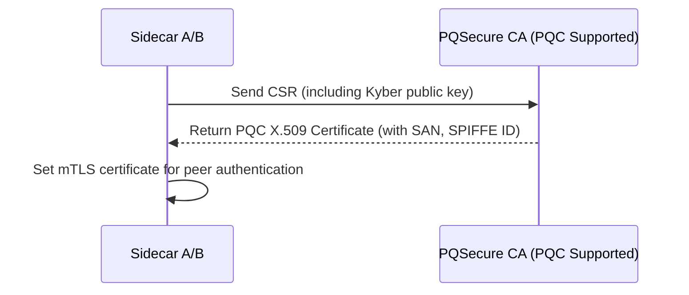
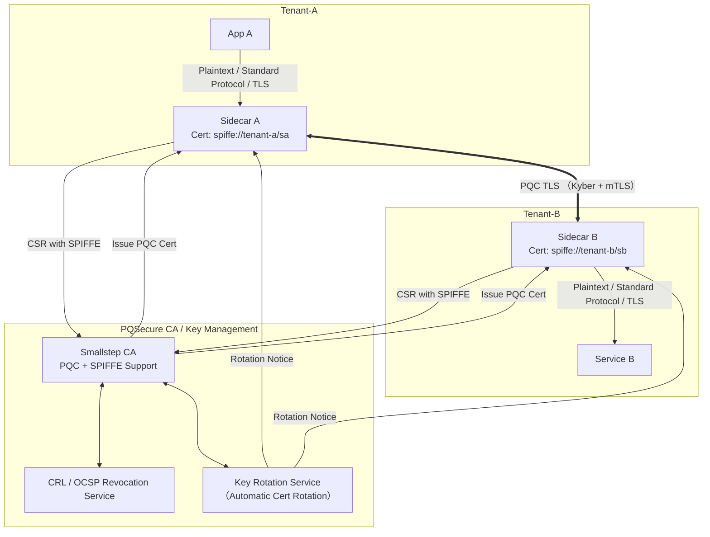
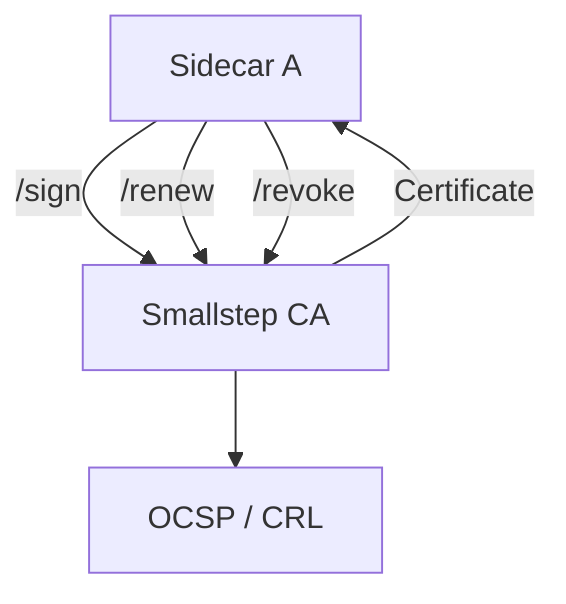

# PQSecure Mesh: A Zero Trust Transparent Proxy Architecture for PQC Communication

## 1. Architecture Overview

**PQSecure Mesh** is a Sidecar-based communication architecture that supports **Post-Quantum Cryptography (PQC)**, **gRPC/HTTP multi-protocol proxying**, and **Zero Trust identity verification**. It is designed to enable **secure PQC communication without requiring modifications to existing systems**.

### Mermaid Architecture Diagram



---

## 2. Zero Trust Mapping Table

| Zero Trust Principle | PQSecure Mesh Implementation |
| --- | --- |
| Identity-Centric | Sidecar uses PQC certificate and mTLS mutual authentication |
| Encrypt and Verify Every Communication | All traffic between sidecars uses PQC TLS to prevent MITM and lateral movement |
| Least Privilege and Policy Control | Each sidecar can enforce ACLs and behavior policies |
| Observability and Packet Auditing | Built-in logs, metrics, and trace hooks compatible with SIEM |
| Remote Certificate Revocation and Dynamic Access Control | Supports short-lived certificates and dynamic permission updates with built-in CA |
| Prevent Lateral Movement | Each sidecar is a boundary enforcement point, requiring PQC certificate-based communication |

---

## 3. Key Management Flow (PQC Support)

### Architecture Highlights:

- CA: Recommended to use **Smallstep CA** with **SPIFFE ID**
- Certificates: Support for **Kyber**, **Dilithium** via **oqs-provider**
- Multi-tenant isolation via SPIFFE path, TTL, auto-rotation, and revocation support
- Each sidecar automatically sends CSR upon startup with endpoint metadata binding

### Sequence Flow:



### Mermaid Diagram: Registration, Signing, Rotation, Revocation, Multi-Tenant



### Recommended Certificate Design

- **SubjectAltName**: `spiffe://tenant-x/sidecar-y`
- **TTL**: Short-lived (e.g., 12h, 24h) to support automated rotation
- **Revocation**: OCSP and CRL supported
- **Auto-Rotation**:
    - Re-issue on each startup
    - Periodic monitoring and early renewal before expiration

---

## 4. Endpoint ACL / Policy Design

Sidecars include a built-in lightweight ACL/Policy engine supporting:

- Whitelisting by certificate ID (SPIFFE ID or SAN)
- HTTP / gRPC method control
- Namespace isolation (e.g., tenant-A / tenant-B)
- Future support for WASM-based policy plugins

### Example Policy Configuration

```yaml
id: sidecar-a
allow_from:
  - id: "spiffe://mesh/sidecar-b"
  - id: "spiffe://mesh/auditor"
allow_methods:
  - GET /status
  - POST /report

```

---

## 5. Smallstep CA Integration Architecture & Roles

**Smallstep CA** serves as the trust infrastructure for certificate registration, signing, revocation, and rotation in PQSecure Mesh. While it is not part of the core sidecar module, it is critical for secure operations.

### Integration Pattern

Module: `controller/identity`

- Defines `ICertificateAuthority` Trait
- Default Implementation: `SmallstepCAClient`

```rust
pub trait CertificateAuthority {
    fn request_certificate(&self, csr: CsrRequest) -> Result<CertificateBundle>;
    fn renew_certificate(&self, cert: Certificate) -> Result<CertificateBundle>;
    fn revoke_certificate(&self, cert_id: &str) -> Result<()>;
}

```

### Mermaid Diagram: Smallstep CA API Integration



---

## 6. Use Case Scenarios

| Scenario | Description |
| --- | --- |
| Legacy Systems PQC Enablement | Wrap legacy apps with Sidecars for PQC-secured communication without changes |
| Secure IoT/OT Device Onboarding | Devices without TLS support connect via edge-side Sidecars with PQC |
| Third-party API Proxy & Isolation | Secure APIs lacking certificate auth with sidecar-based encryption and ACLs |
| Multi-tenant Service Mesh Isolation | Each tenant uses Sidecars for namespace-based isolation and certificate-based auth |

---

## 7. Extension Modules & Future Roadmap

- Modular plugins for gRPC / Kafka / REST support
- Support for PQC + Classical Hybrid TLS (NIST Standard)
- OpenTelemetry and log exporter integration
- WASM-based policy decision engine
- Integration with ZTA control plane and visualization dashboards

---
